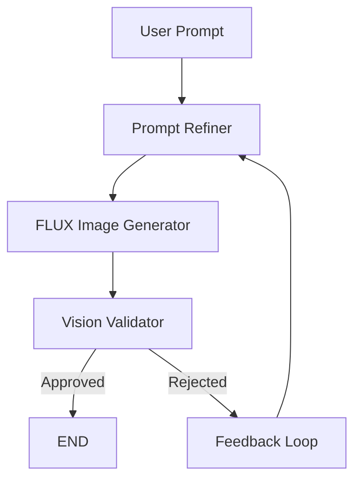

## YouTube Thumbnail Generator
An intelligent, stateful agentic pipeline built with **LangGraph**.

The system automatically:
- generates thumbnails
- validates image quality
- critiques failures
- retries with improved prompts

Automated Validation Loop
  - Vision-based thumbnail critique
  - Detects dark or low-energy outputs
  - Triggers retry refinement loop
 

## Core Libraries

| Library | Purpose |
|---|---|
| LangGraph | Stateful orchestration |
| OpenAI SDK | NVIDIA API integration |
| HuggingFace Hub | FLUX image generation |
| Pillow | Image processing |
| python-dotenv | Environment management |


## Validation Workflow

The validator agent checks:
- brightness
- composition
- energy
- readability

If validation fails:
1. feedback is generated
2. prompt is refined
3. image is regenerated


## Workflow



## Project Structure

```text
.
├── .env
├── thumbnail_generate_validate.py
├── tests.ipynb
└── README.md
```

## Quick Start Guide

### 1. Prerequisites & Installation

Clone or enter your repository directory and install the necessary dependencies:

```bash
pip install langgraph openai huggingface_hub python-dotenv pillow ipython

```

### 2. Environment Configuration

Create a file named `.env` in the root folder of the workspace and include your valid platform credentials:

```ini
NVIDIA_API_KEY="nvapi-your-nvidia-integrated-token-goes-here"
HF_TOKEN="hf_your_huggingface_inference_token_goes-here"

```

### 3. Basic Execution

You can run the engine directly from a terminal execution script or import it into your custom applications:

```python
from thumbnail_generate_validate import YTThumbnail

# Initialize the state machine with your video topic
yt = YTThumbnail(user_prompt="mickey mouse rowing a boat")

# Execute the automated generation, validation, and correction loop
yt.generate_thumbnail()

```

### 4. Interactive Testing

For step-by-step validation, visual workflow graphs, and sample output inspections, launch your environment and open the interactive notebook:

```bash
jupyter notebook tests.ipynb

```

"""
